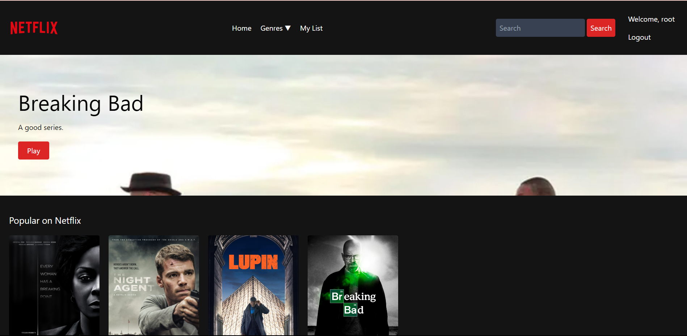
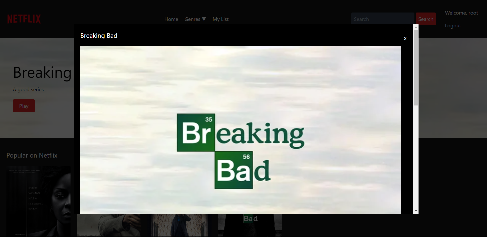
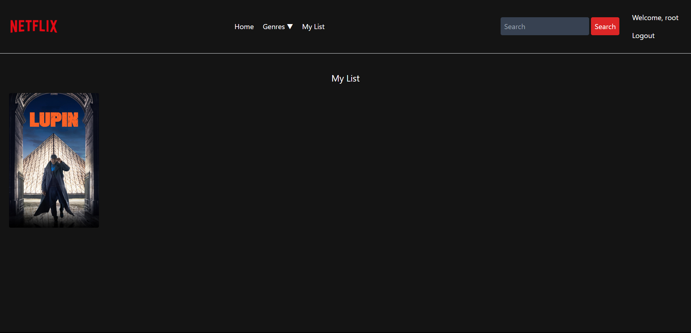
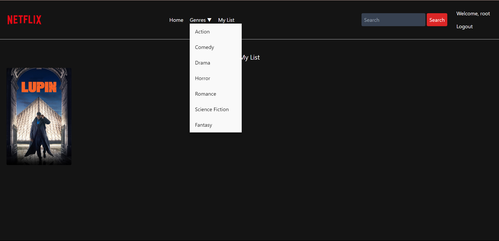
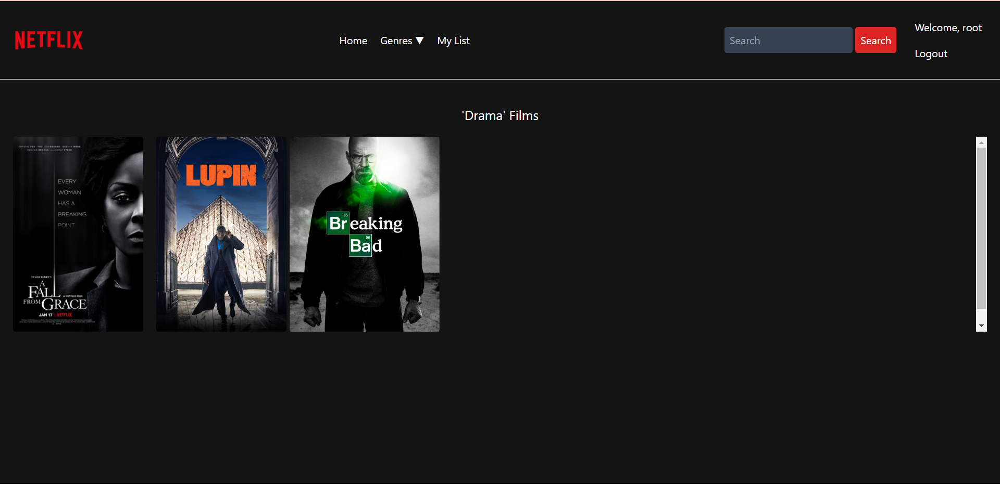
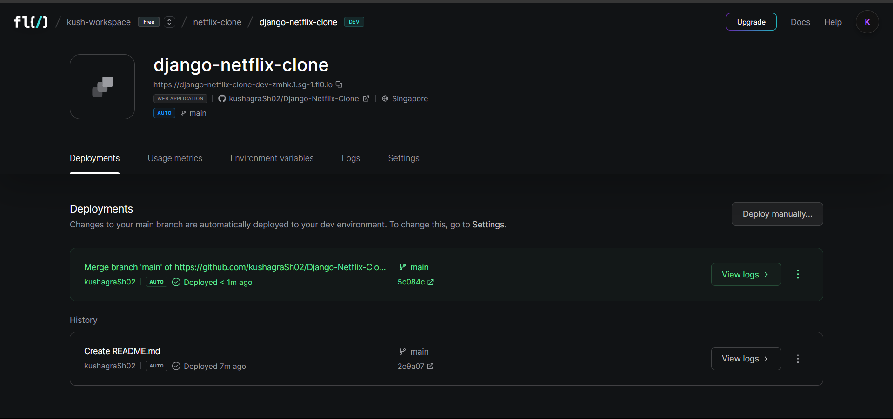

# Django-Netflix-Clone
A netflix clone using Django, HTML, CSS and JS.

```
We create a Netflix clone application where users can login and view movies and tv series. Admin can add movies from backend.
We used HTML, Javascript and CSS for Frontend and Django for backend development. We use FLO (https://app.fl0.com/) for website deployment.
```

### Sceeenshots of Application






